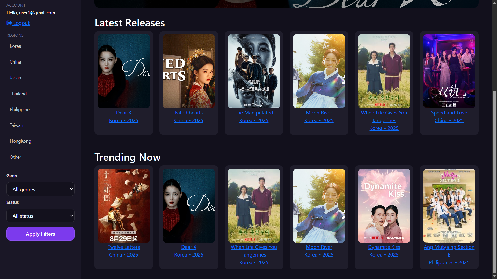
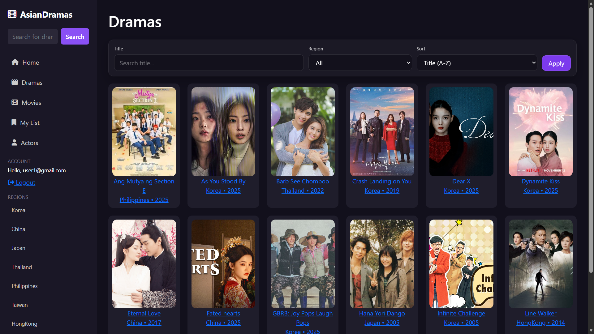
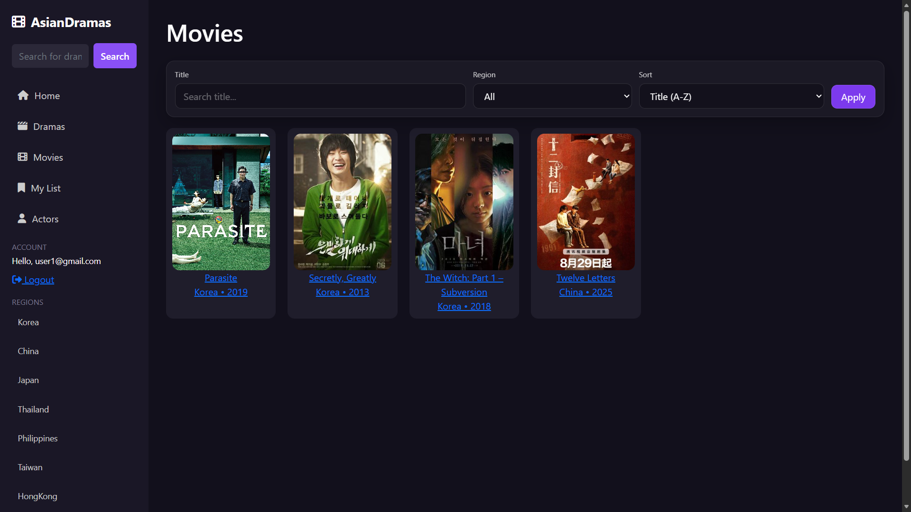
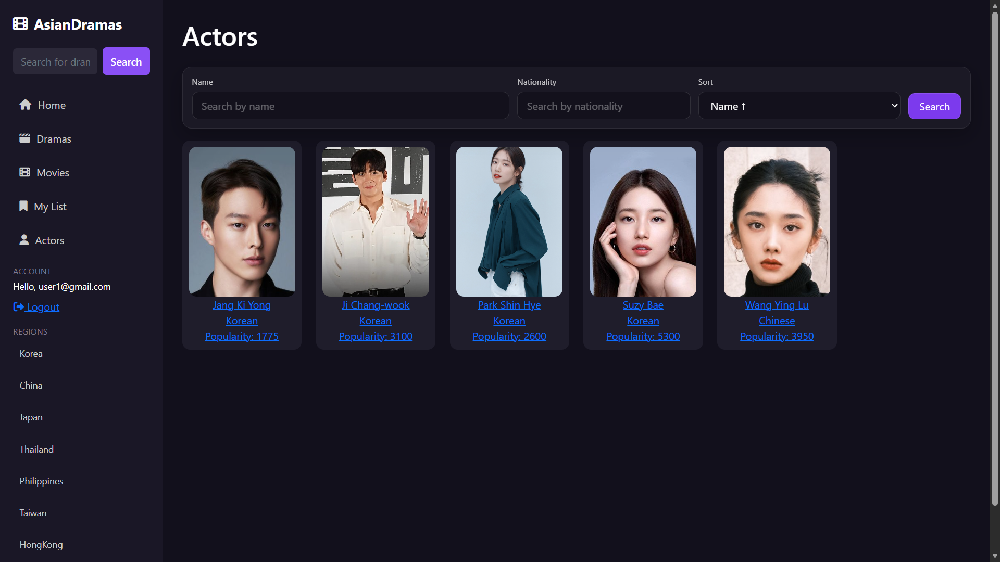

# AsianDramas

AsianDramas is an ASP.NET Core MVC web application for browsing and managing Asian dramas, actors, and user reviews.  
The project demonstrates a complete MVC architecture with authentication, authorization, and database-driven content.


## Features

### User roles
- Guest – read-only access
- User – search, filter, pagination
- Admin – full CRUD access


### Dramas
- Drama catalog with detailed pages
- Genre, region, year, and status information
- Average rating calculated from user reviews


### Actors
- Actor profiles with personal information
- Actor-specific reviews
- Popularity calculation based on activity


### Reviews
- Authenticated users can add reviews
- Authorization checks ensure users can edit/delete only their own reviews
- Secure role-based access control


## Technologies Used

- ASP.NET Core MVC
- C#
- Entity Framework Core
- MS SQL Server
- HTML, CSS, JavaScript


## Installation & Setup

### Prerequisites
- Visual Studio 2022
- .NET 6 or newer
- SQL Server / SQL Server Express

### Steps

1. Clone the repository:
```
git clone https://github.com/vkatreva/AsianDramas.git
```
2. Open the solution in Visual Studio 2022

3. Update the connection string in:
```
appsettings.Development.json
```

4. Apply database migrations:
```
Update-Database
```
5. Run the project

## Screenshots

### Home page


### Home page


### Home page


### Dramas page


### Movies page


### Actors page

